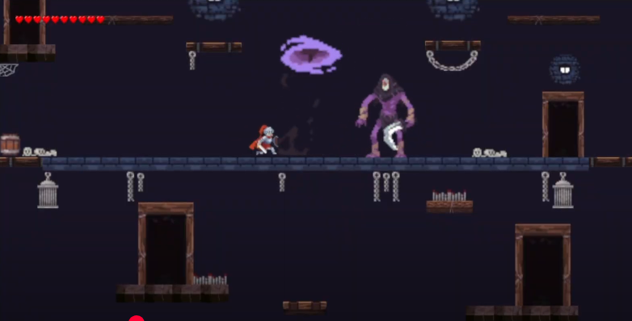

  

## Overview

The King’s Fall is a 2D vertical platformer where players progress upward through increasingly difficult levels while navigating enemies, hazards, and environmental challenges. The game emphasizes precise movement, combat timing, and risk management, where mistakes can result in significant loss of progress.

## Tech Stack

- Engine: Unity (2D)
- Language: C#
- Tools: Unity Animator, Physics System (Colliders, Rigidbodies)

## My Contributions

- Designed and implemented sprite animations for characters and enemies using Unity Animator
- Developed combat and interaction systems, including hitboxes, damage handling, and collision detection
- Built environmental mechanics such as traps, hazards, and platform interactions
- Implemented player–environment and player–enemy collision systems using Unity physics
- Contributed to boss fight design, including attack patterns and encounter flow
- Helped shape overall game direction and gameplay experience

## Key Features

- Vertical progression system with increasing difficulty across levels
- Combat mechanics including attacking, parrying, and enemy interactions
- Environmental hazards (spikes, disappearing platforms, traps)
- Puzzle elements such as door selection and traversal mechanics
- Multiple boss fights with unique attack patterns and behaviors

## Challenges & Decisions

- Balanced combat responsiveness with platforming precision to maintain fluid gameplay
- Designed collision and damage systems to feel fair while maintaining difficulty
- Coordinated animation and gameplay systems to ensure smooth player feedback during combat

## Links

- Documentation: [The King's Fall](https://km584.github.io/SpaghettiCode.github.io/)
- Playable Build: [The King's Fall .zip](https://km584.github.io/SpaghettiCode.github.io/downloads/kings-fall.zip)
