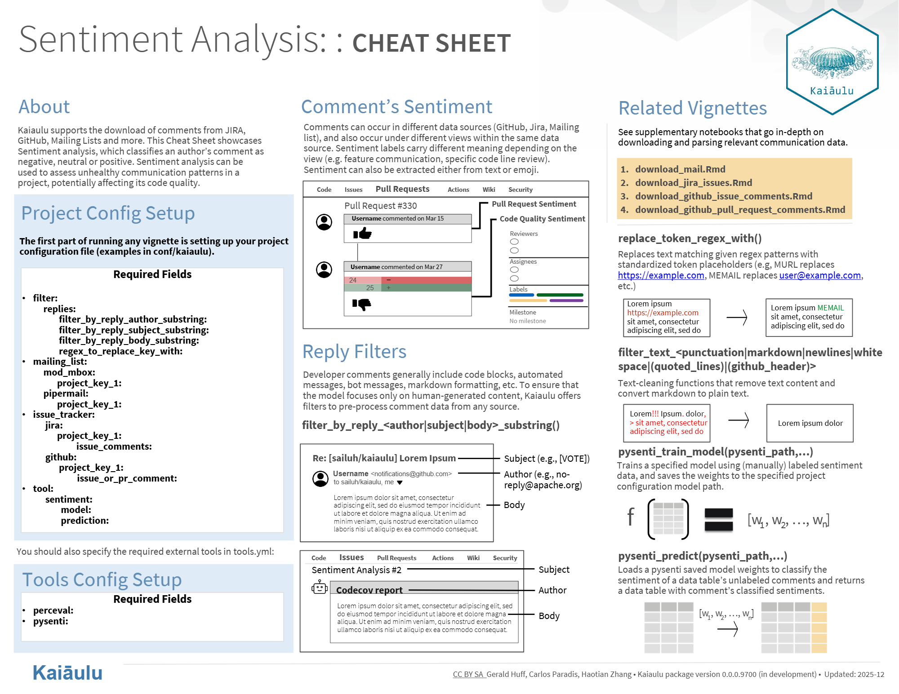

  

## Overview

Contributed to Kaiaulu, an open-source software analytics platform, by integrating and extending a sentiment analysis pipeline to analyze developer communication across sources such as GitHub, Jira, and mailing lists. The feature enables identification of communication patterns that may impact project health and collaboration.

## Tech Stack

- Language: Python
- Libraries: Hugging Face Transformers (pre-trained models)
- Domain: Natural Language Processing (NLP)
- Platform: Kaiaulu (open-source software analytics system)

## My Contributions

- Integrated an existing sentiment analysis system into Kaiaulu’s architecture, ensuring compatibility with its reproducibility-focused design
- Refactored the NLP pipeline to support a wider range of Hugging Face transformer models beyond the original implementation
- Implemented a text preprocessing pipeline using regex-based tokenization to normalize noisy data (emails, URLs, metadata) for accurate sentiment classification
- Enabled sentiment analysis across developer communication sources (GitHub issues, pull requests, Jira, and mailing lists)
- Preserved original model intent while restructuring code to align with platform constraints and extensibility requirements
- Conducted testing, debugging, and iterative development within an open-source workflow
- Led design discussions with project sponsor, using architectural diagrams to communicate implementation strategy and continuously refine code integration

## Challenges & Decisions

- Adapted a research-oriented sentiment analysis implementation into a production-compatible system within Kaiaulu
- Balanced maintaining model accuracy with strict architectural constraints focused on reproducibility
- Designed preprocessing strategies to reduce noise in real-world developer communication data without losing semantic meaning
- Required deep understanding of an existing codebase to safely integrate and extend functionality

## Links

Check out the official [Kaiaulu](http://itm0.shidler.hawaii.edu/kaiaulu/) website
